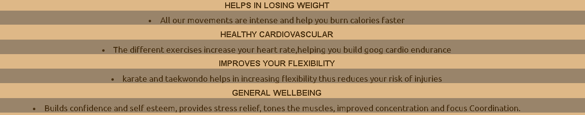
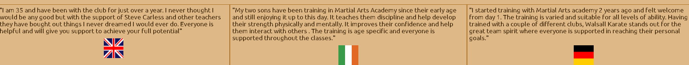
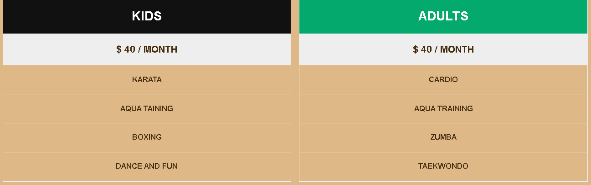
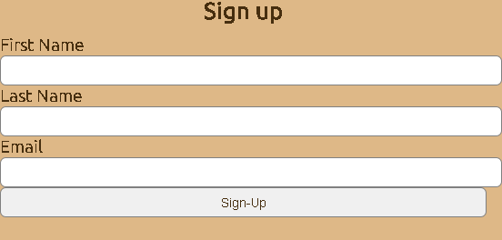
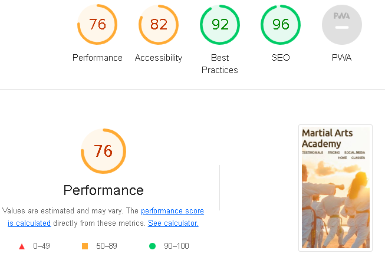

 # Martial Arts Academy

 

# Fitness for Body and Mind
## At Martial arts academy we teach dynamic self defence for mental forcus and discipline.
* Martial arts with us will improve your self confidence
* You will also improve your defence skills
* The full body workout will also increase your flexibility
* The exercise also lowers your blood pressure and heart rate

# Features
## Navigation 
* The navigation bar is in the right hand corner and shows us the different link we can go to.
* We have the Home, Classes, Testimonial, Pricing and Social media links.
* At the Header we can see the Adult and the kids class training together.

# Main Page
## Advantages of training with us.
* I explained below the main benefits of training with us.

# Classes
## The classes time table for kids 

## The classes  time table for adults

# Testimonials 
* The testimonial section shows that our customers are happy with our services
* Our customers give us the credibility and high level of trustworthiness
* Our happy customers turn into loyal fans

# Pricing
* Our pricing list show the various packages we have for the kids and adults
* Our pricing also shows us the costs associated with the two groups

# Sign-up
* The sign-up has a form to collect details of the adults and kids
* The sign-up also has a form validation

# Testing
* I tested the page works in different browsers 
* The header, navigation, main page, classes, testimonials, pricing, sign-up and contact are legible and easy to understand

# Validator testing

## HTML 
* Some errors were returned when passing through W3C HTML validator
## CSS
* No errors were found in the W3C CSS validator
## Accessibility score

 

 # Deployment 
 ## THis sit was deployed to github pages
 * From Github repository,navigate to the settings tab
 * From the source dropdown,select main branch
 * From main branch the page will provide the complete website

 # Credits
 ## Content
 * Code institue LoveRunnning project and coding club project
 * Google

 # Media 
 * The image was taken from Google.
